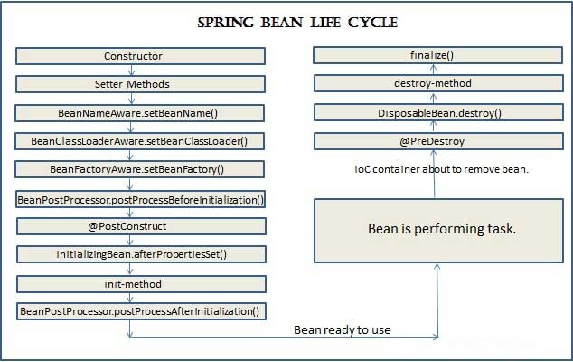

# Study schedule

## Schedule - TODO

- Redo all exams
- Go over topics that you study with on vmware site
- Redo all exams
- Do questions online you haven't done before
- Use gpt as a test?
- Get set up for test

## Topics to Study

- Brush up on annotation-based security

- Brush up on test rest template

- Rest status codes

- Callback interfaces JDBC template

- Brush up on @WebMvcTest

- MVC matchers, ANT MAtchers, request matchers etc spring security

- @RequestMappingAttributes

- How to close an application context in spring

- @Order and how its used

- @Conditional and how its used

- Dispatcher servlet and everything around it

- Idempotent HTTP methods are those that can be repeated multiple times with the same effect as if they were executed once.

- EnableAspectJAutoProxy

- Request mapping arguments

- CGlIB proxy and jdk proxys and aspectj proxys

- Spring view resolvers and model views etc

- Spring bean life cycle:
    

- supported controller method arguments

    ```txt
    jakarta.servlet.http.HttpSession: Enforces the presence of a session. As a consequence, such an argument is never null. Note that session access is not thread-safe. Consider setting the RequestMappingHandlerAdapter instance’s synchronizeOnSession flag to true if multiple requests are allowed to concurrently access a session.

    java.util.Locale: The current request locale, determined by the most specific LocaleResolver available (in effect, the configured LocaleResolver or LocaleContextResolver).

    java.security.Principal: Currently authenticated user — possibly a specific Principal implementation class if known.

    https://docs.spring.io/spring-framework/reference/web/webmvc/mvc-controller/ann-methods/arguments.html
    ```

- User details

- Spring HATEOAS

- Enabling the execution of SQL scripts prior to running test methods.

- read up on SPEL in spring

- Destroy methods are called in the same order:

    ```txt
    Methods annotated with @PreDestroy

    destroy() as defined by the DisposableBean callback interface

    A custom configured destroy() method
    ```

## Notes

### Spring Boot Actuator

#### 🔹 What is Spring Boot Actuator?

- Provides **production-ready features** to help monitor and manage applications.
- Exposes **endpoints** via HTTP (or JMX) for metrics, health checks, etc.
- Integrates with **Micrometer** for metrics collection.

---

#### 🔹 Key Dependencies

```xml
<!-- Add this in pom.xml -->
<dependency>
  <groupId>org.springframework.boot</groupId>
  <artifactId>spring-boot-starter-actuator</artifactId>
</dependency>
```

```groovy
// For Gradle
implementation 'org.springframework.boot:spring-boot-starter-actuator'
```

---

#### 🔹 Common Actuator Endpoints

| Endpoint               | Description                              |
|------------------------|------------------------------------------|
| `/actuator/health`     | Shows application health (UP/DOWN)       |
| `/actuator/info`       | Displays arbitrary app info              |
| `/actuator/metrics`    | Exposes application metrics              |
| `/actuator/env`        | View environment properties              |
| `/actuator/beans`      | Shows all Spring beans                   |
| `/actuator/mappings`   | Shows all URL mappings                   |
| `/actuator/loggers`    | View/change log levels at runtime        |
| `/actuator/threaddump` | JVM thread dump                          |

---

#### 🔹 Endpoint statuses

- By default, Spring Boot Actuator defines four different values as the health Status:

    ```txt
    UP — The component or subsystem is working as expected
    DOWN — The component is not working
    OUT_OF_SERVICE — The component is out of service temporarily    
    UNKNOWN — The component state is unknown
    ```

---

#### 🔹 Enabling Endpoints

- By default, only `/health` and `/info` are enabled.
- Configure in `application.properties` or `application.yml`:

```properties
management.endpoints.web.exposure.include=*
```

---

#### 🔹 Security

- Actuator endpoints can be **secured** using Spring Security.
- Customize access control:

```properties
management.endpoints.web.exposure.include=health,info
management.endpoint.health.show-details=always
```

- Secure endpoints via role-based access in your `SecurityConfig`.

---

#### 🔹 Custom Info Properties

- Add custom entries to `/actuator/info`:

```properties
info.app.name=MyApp
info.app.description=Spring Boot App
```

- Access via: `/actuator/info`

---

#### 🔹 Health Indicators

- Built-in indicators: `db`, `diskSpace`, `ping`, `redis`, etc.
- Custom indicators:

```java
@Component
public class MyHealthIndicator implements HealthIndicator {
    @Override
    public Health health() {
        return Health.up().withDetail("custom", "all good").build();
    }
}
```

---

#### 🔹 Metrics with Micrometer

- Micrometer is the **metrics facade** used by Actuator.
- Supports multiple backends: Prometheus, Datadog, New Relic, etc.
- Metric examples:
  - `jvm.memory.used`
  - `http.server.requests`
  - `system.cpu.usage`

---

#### 🔹 Custom Metrics Example

```java
@Autowired
private MeterRegistry meterRegistry;

@PostConstruct
public void init() {
    meterRegistry.counter("custom.counter").increment();
}
```

---

#### 📊 Micrometer Metric Types in Spring Boot Actuator

| Type               | Best For                         | Increments? | Measures Duration? |
|--------------------|----------------------------------|-------------|---------------------|
| `Counter`          | Count of events (e.g. logins)    | ✅          | ❌                  |
| `Gauge`            | Varying value (e.g. queue size)  | ❌          | ❌                  |
| `Timer`            | Time per operation               | ✅          | ✅                  |
| `DistributionSummary` | Data sizes, value distribution | ✅         | ❌                  |
| `LongTaskTimer`    | Long-running tasks               | ✅          | ✅                  |

---

#### 🔹 Management Port and Context

- Run actuator endpoints on a **different port**:

```properties
management.server.port=8081
```

- Set different base path:

```properties
management.endpoints.web.base-path=/manage
```

---

#### 🔹 JMX Support

- Expose endpoints via JMX:

```properties
spring.jmx.enabled=true
management.endpoints.jmx.exposure.include=*
```

#### ✅ Best Practices

- Limit exposed endpoints in production (`include=health,info`)
- Use `management.endpoint.health.show-details=when-authorized`
- Integrate with Prometheus/Grafana for observability
- Use actuators in cloud-native deployments (e.g., k8s probes)

---

🎯 **Exam Tip**: Know how to expose endpoints, use different metric types, and integrate Actuator with Micrometer for observability.

### Spring Core

### Spring AOP

- **AOP**: Aspect-Oriented Programming – separates cross-cutting concerns.
- **Cross-cutting Concerns**: Logging, security, transactions, etc.
- **Aspect**: Module encapsulating cross-cutting logic.
- **Advice**: Action taken at a specific point in program (join point).
- **Join Point**: Specific execution point (e.g., method call).
- **Pointcut**: Expression that matches join points.
- **Weaving**: Applying aspects to target objects.
- **Runtime Proxies**: Spring AOP uses proxies (JDK or CGLIB).

---

#### 🔹 Types of Advice

- `@Before` – Runs before method execution.
- `@After` – Runs after method execution (regardless of outcome).
- `@AfterReturning` – Runs after successful execution.
- `@AfterThrowing` – Runs if an exception is thrown.
- `@Around` – Wraps the method execution (manual control via `proceed()`).

---

#### 🔹 Declaring Aspects

- `@Aspect` – Marks a class as an aspect.
- `@Component` – Makes aspect a Spring-managed bean.
- `@EnableAspectJAutoProxy` – Enables AOP support in `@Configuration`.

---

#### 🔹 Defining Pointcuts

- **execution**: Match method signatures  
  `execution(* com.example.service.*.*(..))`
- **within**: Match all methods in classes under a package  
  `within(com.example..*)`
- **@annotation**: Match methods annotated with a specific annotation  
  `@annotation(com.example.MyAnnotation)`
- **args, this, target**: Match based on object/arg types

---

#### 🔹 Around Advice

- Signature:  
  `public Object around(ProceedingJoinPoint pjp) throws Throwable`
- Use `pjp.proceed()` to execute the target method.
- Can modify arguments and return values.

---

#### 🔹 AOP Proxy Mechanisms

- **JDK Dynamic Proxy** – Used when target implements interface.
- **CGLIB Proxy** – Used when no interface is implemented.
- **Note**: Proxying occurs at runtime, not compile-time.

---

#### 🔹 Spring AOP Limitations

- Only method execution join points supported.
- Self-invocation within same bean is **not** advised (no proxy involved).

---

#### 🔹 Common Use Cases

- Logging method calls
- Transaction management
- Access control (security)
- Performance metrics
- Caching

---

#### 🔹 Key Annotations Summary

```java
@Aspect
@Component
@EnableAspectJAutoProxy

@Before("pointcutExpression")
@After("pointcutExpression")
@AfterReturning("pointcutExpression")
@AfterThrowing("pointcutExpression")
@Around("pointcutExpression")
```

### 💸 Spring Transaction Management (AOP)

---

#### 🔹 What is Transaction Management?

- Ensures **data consistency** in applications using **ACID** principles.
- Spring provides **declarative** and **programmatic** transaction management.
- **Declarative (AOP-based)** is preferred and common in Spring apps.

---

#### 🔹 Key Dependency (Spring Data / Tx)

```xml
<dependency>
  <groupId>org.springframework.boot</groupId>
  <artifactId>spring-boot-starter-data-jpa</artifactId>
</dependency>
```

Or explicitly:

```xml
<dependency>
  <groupId>org.springframework</groupId>
  <artifactId>spring-tx</artifactId>
</dependency>
```

---

#### 🔹 Core Annotation: `@Transactional`

- Used on **class** or **method** level.
- Spring creates **AOP proxy** to manage transactions.

```java
@Service
public class MyService {

    @Transactional
    public void performDbOperation() {
        // begin transaction
        // DB logic here
        // commit or rollback on exception
    }
}
```

---

#### 🔹 How It Works (AOP)

- Uses **proxy-based AOP** (JDK dynamic or CGLIB).
- Intercepts calls to `@Transactional` methods.
- Rolls back transaction on **unchecked exceptions** (`RuntimeException`, `Error`).

---

#### 🔹 Propagation Types (TX Propagation)

| Type                 | Behavior                                                                 |
|----------------------|--------------------------------------------------------------------------|
| `REQUIRED` (default) | Join existing or create new if none                                     |
| `REQUIRES_NEW`       | Suspends existing, always creates new                                   |
| `NESTED`             | Executes within nested transaction (if supported by DB)                 |
| `MANDATORY`          | Must run within existing transaction or throw exception                 |
| `SUPPORTS`           | Join existing if present; else run non-transactional                    |
| `NOT_SUPPORTED`      | Suspends transaction; runs without                                      |
| `NEVER`              | Fails if a transaction is active                                        |

Example:

```java
@Transactional(propagation = Propagation.REQUIRES_NEW)
public void createLogEntry() {
    // runs in its own transaction
}
```

---

#### 🔹 Rollback Rules

- By default, Spring only rolls back on **unchecked exceptions**.
- To roll back on **checked exceptions**, specify explicitly:

```java
@Transactional(rollbackFor = SQLException.class)
public void riskyOperation() throws SQLException {
    // will rollback on SQLException
}
```

---

#### 🔹 Read-Only Transactions

- Optimizes performance for **read-only operations**.

```java
@Transactional(readOnly = true)
public List<User> getAllUsers() {
    return userRepository.findAll();
}
```

- May give hints to DB (e.g., skip locking).

---

#### 🔹 Transaction Isolation Levels

| Level              | Dirty Read | Non-repeatable Read | Phantom Read | Description                                 |
|--------------------|------------|----------------------|--------------|---------------------------------------------|
| DEFAULT            | ❌         | ❌                   | ❌           | Uses the database's default settings       |
| READ_UNCOMMITTED   | ✅         | ✅                   | ✅           | Can read uncommitted changes               |
| READ_COMMITTED     | ❌         | ✅                   | ✅           | Can't read uncommitted changes             |
| REPEATABLE_READ    | ❌         | ❌                   | ✅           | Prevents dirty and non-repeatable reads    |
| SERIALIZABLE       | ❌         | ❌                   | ❌           | Full isolation; may slow down performance  |

```java
@Transactional(isolation = Isolation.REPEATABLE_READ)
```

---

#### 🔹 Self-Invocation Problem in Transactions

- Just like AOP, **self-invocation bypasses proxy**, so `@Transactional` won't work.

```java
@Transactional
public void outerMethod() {
    innerMethod(); // ❌ No TX management here
}

@Transactional
public void innerMethod() {
    // won't trigger TX
}
```

✅ **Fix**: Call from another bean or use `AopContext` to get proxy.

---

#### 🔹 Combining AOP and @Transactional

- Transaction management is **built on AOP**.
- `@Transactional` applies around advice via Spring proxy.
- Works **only on public methods** by default.

---

#### 🔹 Testing Transactions

- Spring test framework rolls back DB changes after test by default.

```java
@SpringBootTest
@Transactional
public class MyRepositoryTests {
    // DB changes rollback after each test
}
```

---

#### 🔹 Transaction Manager

- Responsible for managing transaction lifecycle (start, commit, rollback).
- Implements `PlatformTransactionManager` interface.
- Common implementations:
  - `DataSourceTransactionManager` (for JDBC)
  - `JpaTransactionManager` (for JPA)
  - `HibernateTransactionManager` (for Hibernate)
- Supports declarative and programmatic transaction management.

---

#### 🔹 Transaction Template

- A utility class to simplify programmatic transaction management.
- Wraps transactional code and reduces boilerplate.
- Uses `PlatformTransactionManager` under the hood.
- Example usage:

  ```java
  TransactionTemplate template = new TransactionTemplate(transactionManager);
  template.execute(status -> {
      // Transactional code
      return null;
  });

---

#### 🔹 Other Attributes

**timeout**: Defines the maximum time (in seconds) that a transaction can run before it is rolled back automatically.

**readOnly**: Indicates whether the transaction is read-only. When set to true, it can optimize the transaction and may prevent accidental changes to the database.

- true: Transaction is read-only.
- false (default): Transaction is read-write.

**rollbackFor**: Specifies which exceptions should cause the transaction to roll back.

- It accepts an array of exception classes. If any of these exceptions are thrown, the transaction will be rolled back.

**noRollbackFor**: Specifies which exceptions should not cause the transaction to roll back, even if they are thrown during the method execution.

---

#### ✅ Best Practices - Transactions

- Use `@Transactional` on **service layer**, not DAO/controller.
- Avoid using on **private/protected** methods.
- Avoid placing it on `@Scheduled` or async tasks (they bypass proxies).
- Handle **rollbackFor** carefully for checked exceptions.
- Split long TXs to avoid locks or performance issues.

---

#### 🧠 Summary Table

| Feature                   | Default / Notes                                    |
|---------------------------|----------------------------------------------------|
| Rollback on               | Unchecked exceptions only                          |
| Works with                | Public methods via proxies                         |
| Isolation level default   | `DEFAULT` (uses DB default)                        |
| Propagation default       | `REQUIRED`                                         |
| Read-only optimization    | `readOnly=true` for selects                        |
| Proxy required            | Yes (self-invocation won't work)                   |
| Testing behavior          | Auto rollback with `@Transactional`               |

---

🎯 **Exam Tip**: Expect questions on propagation, rollback rules, and self-invocation edge cases.
